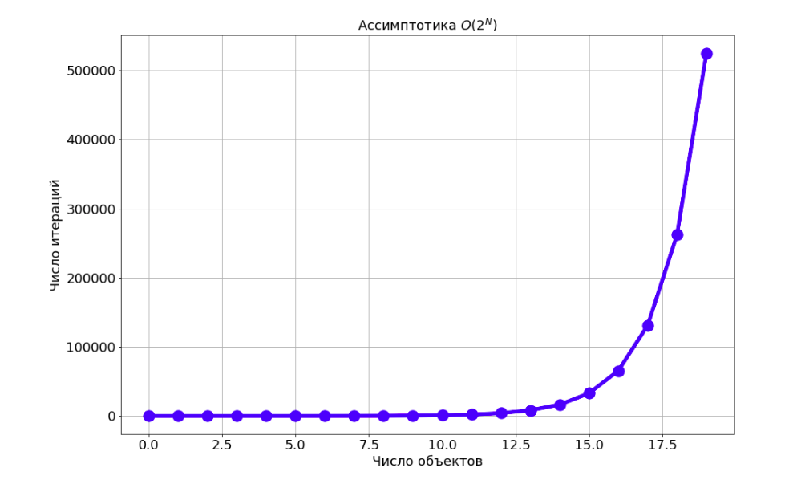
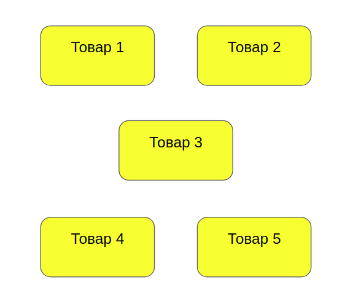
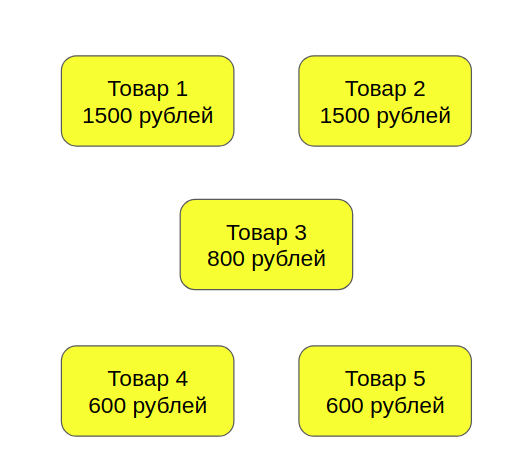
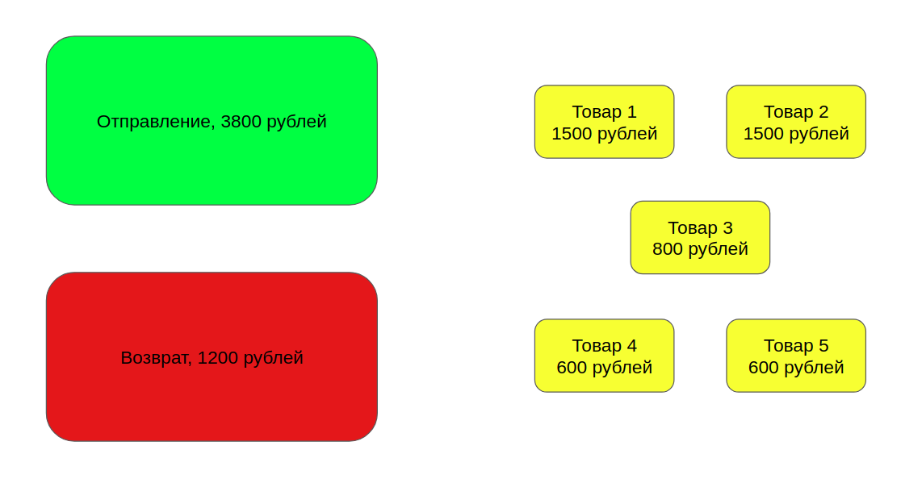
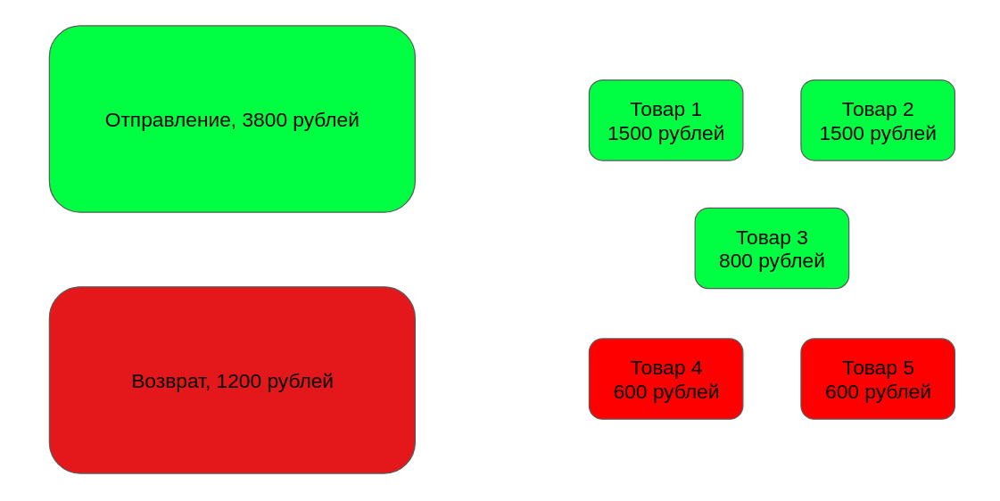
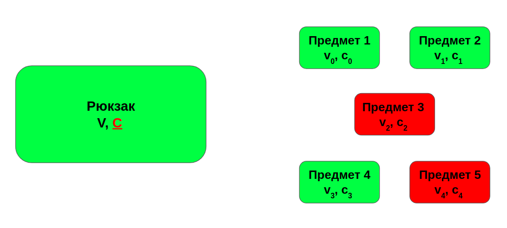
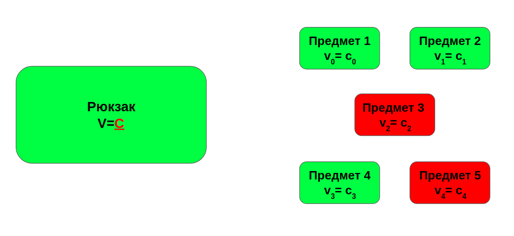

# Факторизация числа по заданному множеству

Данный репозиторий представляет собой алгоритм, позволяющий разложить число по заданному множеству чисел. Например, мы 
имеем набор чисел `1, 2, 2, 3, 4, 6`. Сколькими способами мы можем получить число `5`? Очевидно:

    1, 4
    1, 2, 2
    2, 3
    2, 3

Таким образом, мы перебрали все возможные решения. Обратите внимание, что одно из решений повторяется. Это важно 
учитывать и не допускать лишних повторов.

# Бейзлайн

Давайте сопоставим набору чисел битовую маску:

    [0, 0, 1, 0] 
    
Тогда, чтобы получить решение, достаточно перебрать все битовые маски. Сложность такого алгоритма будет: $O(2^N)$, где
$N$ - размер маски. Очевидно, что уже при 22 элементах, придётся ждать очень долго для получения всех решений.

Здесь следует отметить, что любое решение может найтись довольно быстро. Но если мы хотим убедиться, что решений нет, 
доказать, что оно единственное или же найти все, то время выполнения алгоритма затянется.

Рассмотрим прикладную задачу, которую я решал в своей практике.
 
### Задача

Пусть у нас есть покупки. Мы знаем суммарную цену, т.е. общую сумму всех товаров и цену каждого товара. При этом, клиент
вернул некоторые из товаров. Требуется понять, какие из товаров клиент купил.

### Продолжение

В ряде случаев, нам хочется понимать, сколько решений есть у этой задачи?

### Решение

Есть товары:

Каждый из них сколько-то стоит:

Также есть отправление и возврат:

Существует решение:

Включая и исключая по очереди все в решение, мы можем найти все возможные решения.

# Оптимизация - 1. (Задача о рюкзаке)

Прочитать подробнее можно [тут](https://neerc.ifmo.ru/wiki/index.php?title=%D0%97%D0%B0%D0%B4%D0%B0%D1%87%D0%B0_%D0%BE_%D1%80%D1%8E%D0%BA%D0%B7%D0%B0%D0%BA%D0%B5)
В данном случае, используется идея о том, что не обязательно заполнять всю матрицу, а достаточно пойти от финального решения,
т.е. и рекурсивно перебрать все решения. Таким образом, мы ответим на все вопросы задачи. Проблема данного подхода в том,
что мы не можем делать это итеративно, а значит нам придётся все решения хранить в памяти, а их может быть довольно много.

Важно отметить, что данная задача является частным случаем задачи о рюкзаке. Задача о рюкзаке выглядит так:

Есть рюкзак, у него есть вместимость, а также мы хотим в него набрать предметов максимальной стоимости так, чтобы все они 
поместились. При этом, у каждого предмета есть его стоимость и вес (ограничение). Потенциально ограничений в задаче может 
быть более одного. 

В нашем случае всё проще. Во-первых, вес рюкзака и ограничение в данном случае совпадают.
 

Во-вторых, в отличие от задаче о рюкзаке, нам требуется составить из наших предметов в точности максимальный вес рюкзака.
Не забываем, что вес совпадает с ограничением, либо сказать, что такого решения не существует.

Обратите внимание, как похожа задача о рюкзаке на перебор масок. 

# Оптимизация - 2

Для того, чтобы генерировать решения итеративно, предлагается отранжировать элементы. В данном случае это возможно, покуда
ограничение и вес совпадают. Затем, на каждом шаге, мы будем набивать рюкзак, итерируясь от максимального элемента к 
минимальному и будем пересчитывать остаток. Как только остаток станет меньше 0, возвращемся к предыдущему шагу и продолжаем поиск.
Если остаток равен в точности 0, то возвращаем решение, а затем, с того же места продолжаем поиск.

Заметим, что данное решение работает примерно в 2 раза дольше, чем решение задачи о рюкзаке. При этом, мы можем отдавать
ответы итеративно.

# Установка (python3.7+)

    pip install -r requirements
 

